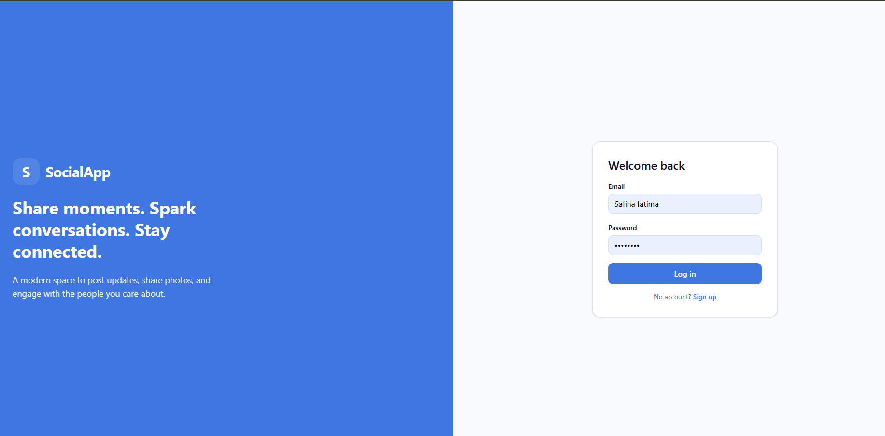
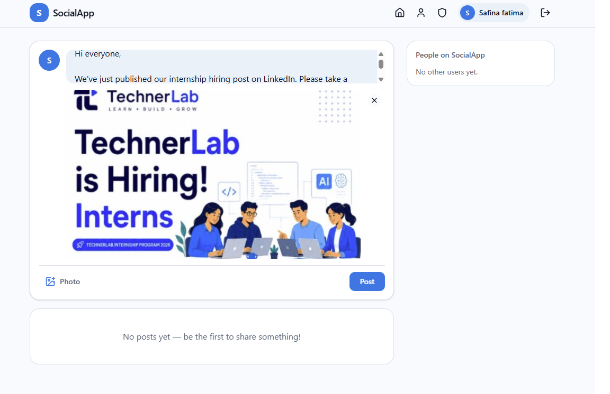
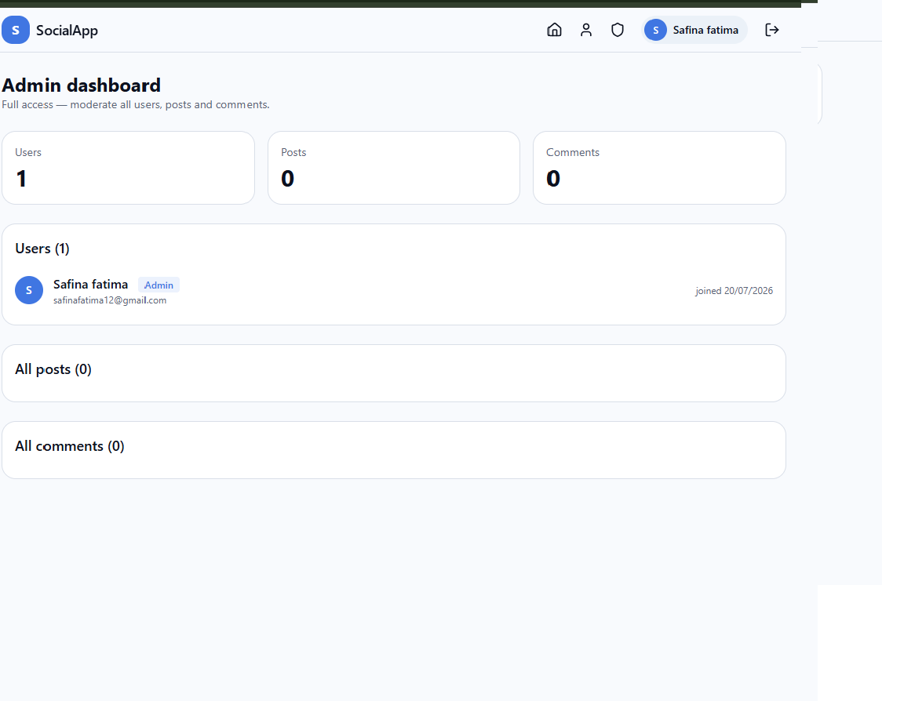
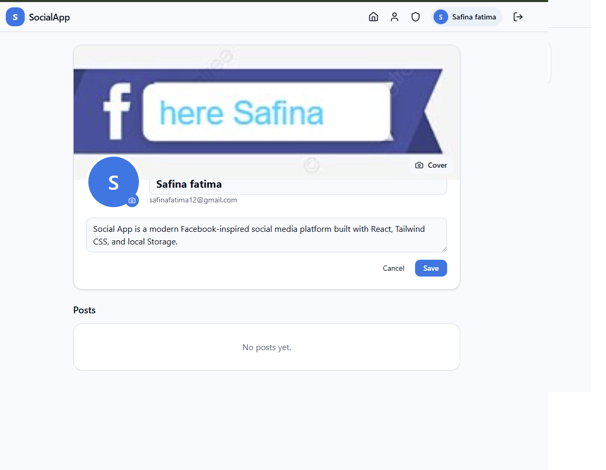

# SocialApp — Facebook-Inspired Social Media Platform

A frontend-only social media app built with React — sign up, post, like, comment, and manage a profile, all persisted in your browser's `localStorage`.

## 1. Live Demo

> **GitHub:** https://github.com/safinafatima61-gif/social-app-safina-fatima/tree/assignment-2  
> **Live Demo (Vercel):** https://social-app-safina-fatima.vercel.app  
> AI key: local `.env` or Vercel Environment Variable `VITE_OPENAI_API_KEY` (never commit `.env`)

## 2. Screenshots

> Add at least 4 screenshots here after running the app locally or visiting the live demo: Feed page, Create Post, Profile page, Dashboard.
>

- **React (Vite)** — frontend framework and build tool
- **React Router v6** — routing, dynamic routes, protected routes
- **Tailwind CSS** — utility-first styling
- **React Hook Form** — all forms with validation
- **Context API** — auth state (`AuthContext`)
- **localStorage** — users, posts, comments, likes, friendRequests, messages, aiSettings
- **OpenAI API (`gpt-4o-mini`)** — AI post, comment, profile, and chat features
- **clsx** — conditional class names
- **React.lazy + Suspense** — code-split pages

## 4. Features (Assignment 1)

- Signup with validation (name, email, password strength, confirm password)
- Login / logout, session persists across page refresh
- Public feed of posts with inline create-post composer
- Guests are redirected to `/login` when they try to like or comment
- Create posts with image upload + live preview, save as draft or publish
- Edit and delete your own posts; toggle public/private
- Post detail page — like/unlike, comments
- Public profile pages with cover image, avatar, bio
- Protected dashboard routes (`RequireAuth`)
- Admin dashboard for the first registered user

## 4b. Assignment 2 Features

### Friend System
- People You May Know (`/people`) with correct sorting and mutual friends count
- Friend requests send / accept / reject / cancel (`/requests`)
- Friends list with Message + Unfriend (`/friends`)
- Profile relationship buttons (Add Friend, Request Sent, Accept/Reject, Message/Unfriend)
- Navbar request-count badge

### Real-Time Chat
- Chat home + conversation panel (`/chat`, `/chat/:userId`)
- Text, image, and video messages with preview before send
- Real-time sync across browser tabs via `storage` event (no WebSockets)
- AI suggestion chips + optional AI auto-reply mode
- Bonus: read receipts (✓ / ✓✓), emoji reactions, message search, AI personality

### AI Integration
- AI Writing Assistant on Create/Edit Post
- Suggest Comment on Post Detail
- Optimise Bio on Profile Settings
- Chat reply suggestions (Mode 1) and auto-reply (Mode 2)

## 5. How to Run Locally

```powershell
cd "social-app"
npm install
npm run dev
```

Open the URL Vite prints (usually `http://localhost:5173`).

### How to Set Up the OpenAI API Key

1. Copy `.env.example` to `.env` in the `social-app` folder
2. Add your key: `VITE_OPENAI_API_KEY=sk-your-key-here`
3. Restart `npm run dev`
4. **Never commit `.env`** — it is already listed in `.gitignore`

> Note: AI features require a valid OpenAI API key. Without it, the rest of the app still works; AI buttons show a setup hint.

## 6. Folder Structure

```
social-app/
├── public/
├── src/
│   ├── assets/
│   ├── components/
│   │   ├── ai/           (AIPostAssistant, AICommentSuggest, AIProfileOptimize)
│   │   ├── chat/         (ConversationList, MessageBubble, MessageInput, ...)
│   │   ├── feed/         (CreatePostComposer, PeopleSidebar)
│   │   ├── friends/      (FriendRequestCard, FriendCard, RequestBadge)
│   │   ├── icons/
│   │   ├── post/
│   │   ├── profile/
│   │   ├── ui/
│   │   └── RequireAuth.jsx
│   ├── context/          (AuthContext)
│   ├── hooks/            (useAuth, usePosts, useFriends, useChat, useAI, ...)
│   ├── layouts/          (MainLayout, AuthLayout, Navbar, Footer, DashboardLayout)
│   ├── lib/              (openai.js)
│   ├── pages/            (Feed, Auth, Profile, People, Friends, Chat, dashboard/...)
│   ├── services/         (storage.js)
│   ├── styles/           (index.css)
│   ├── utils/            (helpers, friendHelpers, chatHelpers)
│   ├── App.jsx
│   └── main.jsx
├── .env.example
└── package.json
```

## 7. localStorage Data Structure

```js
// Key: 'users'
[{ id, name, email, password, bio, location, avatar, coverImage, role, lastSeen, joinedAt }]

// Key: 'posts'
[{ id, authorId, description, image, isPublic, isDraft, createdAt, updatedAt }]

// Key: 'comments'
[{ id, postId, authorId, text, createdAt }]

// Key: 'likes'
[{ id, postId, userId, createdAt }]

// Key: 'friendRequests'
[{ id, fromUserId, toUserId, status, sentAt, respondedAt }]

// Key: 'messages'
[{ id, conversationId, senderId, receiverId, type, content, timestamp, read, aiGenerated, reactions }]

// Key: 'aiSettings'
{ [userId]: { aiChatEnabled, aiMode, aiPersonality } }

// Key: 'currentUser' — logged-in user (password stripped)
```

## 8. Real-Time Chat Architecture

Chat does **not** use WebSockets. When Tab A writes to `localStorage` key `messages`, Tab B receives a browser `storage` event, re-reads messages, and updates React state. Cleanup uses `removeEventListener` in the `useEffect` return. `getConversationId` sorts both user IDs so A→B and B→A share one thread.

## 9. AI Features

All AI calls go through `src/lib/openai.js` + `useAI` hook using `gpt-4o-mini` with `max_tokens: 300`. Errors are caught and shown as inline messages/toasts — they never crash the UI. Mode 2 auto-reply is off by default and must be enabled from the chat AI menu.

## 9. Known Limitations

- Data lives only in the browser — clearing site data or switching browsers/devices loses everything.
- Passwords are stored in plain text in `localStorage`, which is fine for a learning project but never acceptable with a real backend.
- No pagination — every post/comment/like is loaded into memory at once.
- No real-time updates between two open tabs/users beyond a basic `storage` event listener.
- With a real backend (Node/Express + MongoDB, matching the MERN stack), I'd add proper password hashing, JWT auth, image uploads to 
cloud storage, pagination, and real-time notifications.

## 10. Project Title & Tagline

**SocialApp** — a Facebook-inspired social feed built entirely on the frontend, powered by React and localStorage.


# 📘 SocialApp — Facebook-Inspired Social Media Platform

A modern Facebook-inspired social media application built with **React (Vite)**. SocialApp allows users to register, log in,
 create and manage posts, interact through likes and comments, customize their profiles, and experience a responsive social
  networking platform. All application data is stored locally using the browser's **localStorage**, making it a complete 
  frontend-only project.

---

# 🚀 Live Demo

**Live Demo:** https://connect-circle-919.lovable.app/auth


**Live Demo (Vercel):** https://social-app-safina-fatima.vercel.app

# 📸 Screenshots


 


> Add your screenshots after running the project.

| Feed | Dashboard |
|------|-----------|
|  |  |

| Create Post | Profile |
|-------------|---------|
|  |  |

---

# 📖 Project Overview

SocialApp is a Facebook-inspired social networking application developed as a frontend project using React. The application simulates the core functionality of a real social media platform, allowing users to share posts, upload images, interact through likes and comments, and manage personalized profiles.

The primary objective of this project is to demonstrate modern React development practices, reusable component architecture, authentication using Context API, routing with React Router, and browser-based data persistence through localStorage.

---

# ✨ Features

## 🔐 Authentication

- User Registration
- User Login
- Logout
- Persistent Login Session
- Protected Routes
- Form Validation using React Hook Form

---

## 👤 User Profile

- Update Profile Information
- Upload Avatar
- Upload Cover Image
- Edit Bio
- Update Location
- Joined Date
- Public Profile View

---

## 📝 Post Management

- Create New Posts
- Upload Images
- Live Image Preview
- Save Draft Posts
- Publish Posts
- Edit Existing Posts
- Delete Posts
- Public / Private Posts
- Character Counter

---

## ❤️ Social Interaction

- Like Posts
- Unlike Posts
- Add Comments
- Delete Own Comments
- Post Detail Page
- Live Feed
- Newest Posts First

---

## 📊 Dashboard

Authenticated users can:

- Manage Posts
- Publish Drafts
- Edit Profile
- Create New Posts
- Delete Posts
- View Personal Content

---

## 🎨 User Experience

- Responsive Design
- Mobile Friendly Layout
- Dark Mode
- Live Search
- Smooth Navigation
- Modern Facebook-inspired Interface

---

# 🛠 Tech Stack

| Technology | Purpose |
|------------|---------|
| React (Vite) | Frontend Framework |
| React Router v6 | Navigation & Protected Routes |
| Tailwind CSS | Responsive Styling |
| React Hook Form | Form Validation |
| Context API | Authentication State Management |
| localStorage | Browser Data Storage |
| clsx | Conditional Styling |
| React.lazy & Suspense | Code Splitting |

---

# 📂 Folder Structure

```
social-app/
│
├── public/
│
├── src/
│   ├── assets/
│   │
│   ├── components/
│   │   ├── layout/
│   │   │   ├── Navbar.jsx
│   │   │   └── Footer.jsx
│   │   │
│   │   ├── post/
│   │   │   ├── PostCard.jsx
│   │   │   ├── PostForm.jsx
│   │   │   ├── PostActions.jsx
│   │   │   └── CommentSection.jsx
│   │   │
│   │   ├── profile/
│   │   │   └── ProfileHeader.jsx
│   │   │
│   │   ├── ui/
│   │   │   ├── Avatar.jsx
│   │   │   ├── Badge.jsx
│   │   │   ├── Button.jsx
│   │   │   ├── Input.jsx
│   │   │   └── Modal.jsx
│   │   │
│   │   └── RequireAuth.jsx
│   │
│   ├── context/
│   │   └── AuthContext.jsx
│   │
│   ├── hooks/
│   │   ├── useAuth.js
│   │   ├── useLocalStorage.js
│   │   └── usePosts.js
│   │
│   ├── pages/
│   │   ├── FeedPage.jsx
│   │   ├── LoginPage.jsx
│   │   ├── SignupPage.jsx
│   │   ├── ProfilePage.jsx
│   │   ├── PostDetailPage.jsx
│   │   ├── NotFoundPage.jsx
│   │   └── dashboard/
│   │       ├── DashboardLayout.jsx
│   │       ├── PostsDashboard.jsx
│   │       ├── CreatePost.jsx
│   │       ├── EditPost.jsx
│   │       └── ProfileSettings.jsx
│   │
│   ├── utils/
│   │   ├── storage.js
│   │   └── helpers.js
│   │
│   ├── App.jsx
│   └── main.jsx
│
├── package.json
└── README.md
```

---

# 💾 localStorage Structure

```javascript
users
[
  {
    id,
    name,
    email,
    password,
    bio,
    location,
    avatar,
    coverImage,
    joinedAt
  }
]

posts
[
  {
    id,
    authorId,
    description,
    image,
    isPublic,
    isDraft,
    createdAt,
    updatedAt
  }
]

comments
[
  {
    id,
    postId,
    authorId,
    text,
    createdAt
  }
]

likes
[
  {
    id,
    postId,
    userId,
    createdAt
  }
]

currentUser

theme
```

---

# ⚙️ Installation

Clone the repository

```bash
git clone https://github.com/yourusername/social-app.git
```

Move into project

```bash
cd social-app
```

Install dependencies

```bash
npm install
```

Run development server

```bash
npm run dev
```

Open

```
http://localhost:5173
```

Build production version

```bash
npm run build
```

Preview production build

```bash
npm run preview
```

---

# 📚 What I Learned

Building SocialApp significantly improved my understanding of modern React development and frontend architecture. I learned how to create reusable components that keep the project organized and maintainable. Implementing React Router helped me understand protected routes, nested routing, and seamless page navigation. Using Context API allowed me to manage authentication globally without excessive prop drilling. React Hook Form enhanced my skills in building efficient forms with proper validation, while localStorage helped simulate backend functionality by storing users, posts, comments, likes, and application settings. Overall, this project strengthened my knowledge of component-based development, state management, responsive UI design, and real-world frontend application structure.

---

# ⚠️ Current Limitations

- Frontend-only application
- Data is stored only inside browser localStorage
- Passwords are not encrypted
- No backend database
- No cloud image storage
- No pagination
- No real-time messaging
- No push notifications

---

# 🚀 Future Improvements

- Node.js Backend
- Express.js REST APIs
- MongoDB Database
- JWT Authentication
- Password Hashing
- Cloudinary Image Uploads
- Friend Request System
- Real-time Chat
- Notifications
- Infinite Scrolling
- Story Feature
- AI-powered Feed Recommendations

---

# 🎯 Project Objective

The goal of SocialApp is to recreate the core experience of Facebook using modern React technologies
 while following clean code principles, reusable architecture, and responsive UI design. The project demonstrates 
 practical frontend development skills and serves as a strong portfolio project for showcasing React, routing, 
 state management, authentication, and user interaction.

---

# 🏷 Project Tagline

> **SocialApp — A Modern Facebook-Inspired Social Networking Platform built with React, 
Tailwind CSS, Context API, React Router, and localStorage.**